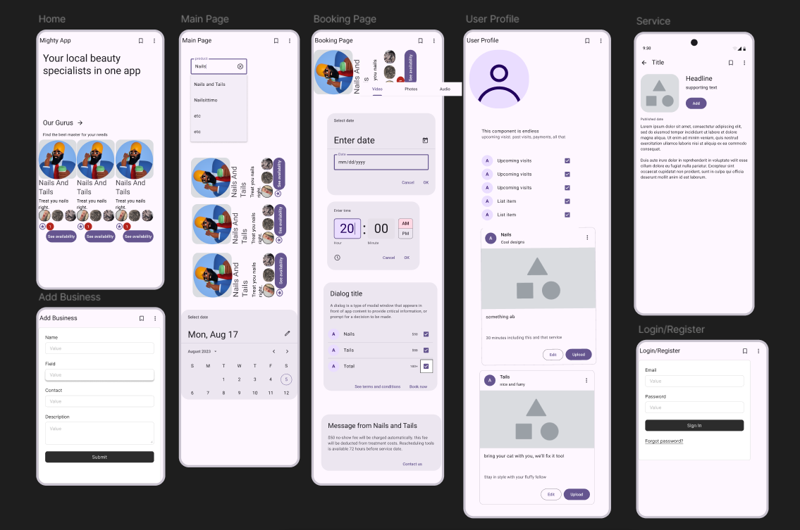
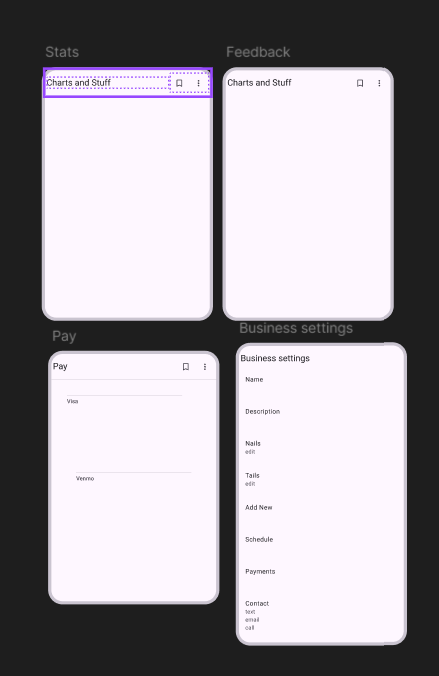
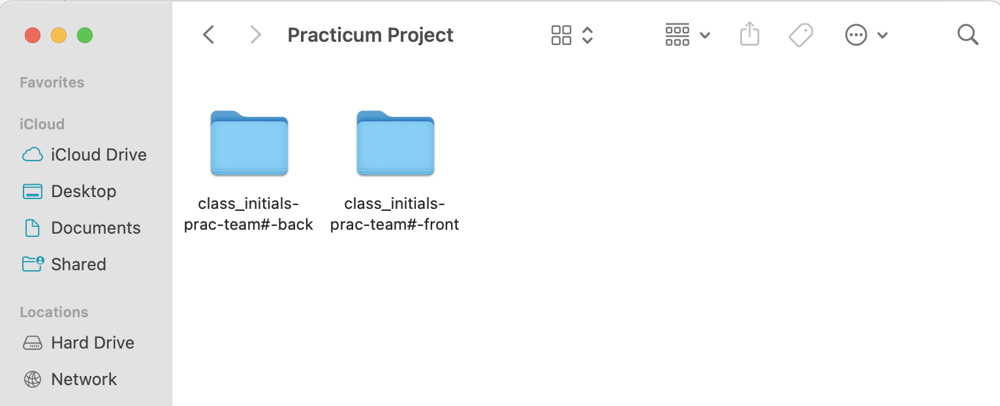
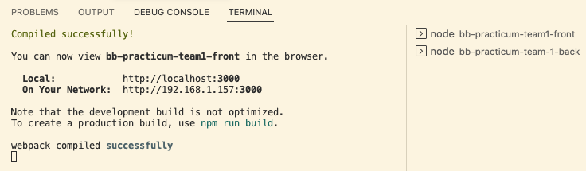

# `Pychee Leachy` by `Mighty Heap`

This application [`Leachy Peachy`](https://gg-pac-team5-front-5srs.vercel.app/) is developed by Team 5 `Mighty Heap`

This Application works with [`Backend API`](https://gg-pac-team5-back-1.onrender.com/api/v1).

## Technologies Used:

- `ReactJs`: Frontend UI developement
- `Vite`: Building tool for frontend
- `ExpressJS` and `NodeJS`: Backend Server
- `Database`: MongoDB
- `Figma`: Initial wireframe Design

## Figma Design:

Page 1:

Page 2:

## Authors:

- [`Anuja Bujurge`](https://www.linkedin.com/in/anuja-bujurge/)
- [`Tianna Spears`](https://www.linkedin.com/in/tiannasp/)
- [`Volodymyr Pisotskyi`](https://www.linkedin.com/in/vpisotski/)
- [`Jeffrey Cheung`](https://www.linkedin.com/in/cheung-k-jeffrey/)
- [`Sergey Kabarin`]()

---

---

---

---

---

# Front-End Repo for Node/React Practicum

This will be the front-end for your team's practicum project.

It is suggested that you run these instructions **after** you setup the back-end server first.
You can go through these steps during your first group meeting in case you need assistance from your mentors.

You will have two folders inside one team folder (one for front-end and one for back-end). Name the parent folder something appropriate (in the below example we title it "Practicum Project"). Then clone directly (do not fork and clone) the front and back repos while inside the parent ("Practicum Project") project folder.

> The front-end app (React) will be running on port 3000. The back-end server will be running on port 8000. You will need to run both the front-end app and the back-end server at the same time to test your app.

### Setting up local development environment

1. Clone this repository to the folder that was already created for both the front-end and back-end repos
2. Run `npm install` to install dependencies
3. Pull the latest version of the `main` branch (when needed)
4. Run `npm start` to start the development server
5. Open http://localhost:3000 with your browser to see the data received the back-end server.
6. Now you have your front-end and back-end running locally!

#### Running the front-end server in Visual Studio Code

Note: In the below example, the group's front-end repository was named `bb-practicum-team1-front` and the back-end repository was named `bb-practicum-team-1-back`. Your repository will have a different name, but the rest should look the same.

#### Running the front-end server in the browser

